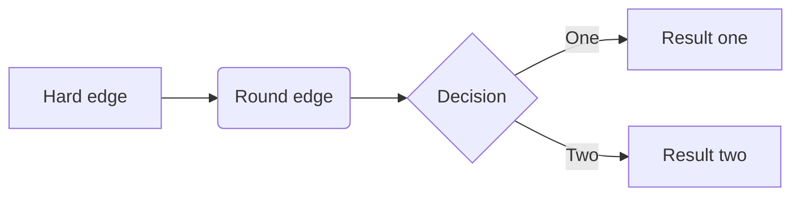

# Tables

Tables are responsive by default, allowing wide tables to have a horizontal scroll to access columns outside of the normal viewport.

<div class="code-example" markdown="1">

| head1        | head two          | three |
|:-------------|:------------------|:------|
| ok           | good swedish fish | nice  |
| out of stock | good and plenty   | nice  |
| ok           | good `oreos`      | hmm   |
| ok           | good `zoute` drop | yumm  |

</div>
```markdown
| head1        | head two          | three |
|:-------------|:------------------|:------|
| ok           | good swedish fish | nice  |
| out of stock | good and plenty   | nice  |
| ok           | good `oreos`      | hmm   |
| ok           | good `zoute` drop | yumm  |
```


# Flow


```sequence
Alice->Bob: Hello Bob, how are you?
Note right of Bob: Bob thinks
Bob-->Alice: I am good thanks!
```
